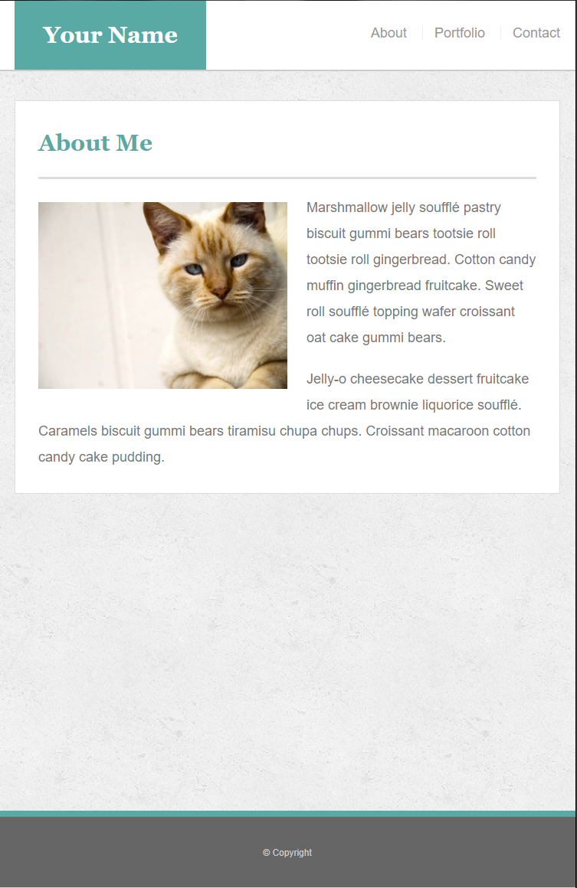

# Responsive-Portfolio
Tasked with creating a responsive portfolio with multiple links.  Portfolio was to contain (3) total pages to include main index.html, contact.html, and portfolio.html.  I was given the following assets to match these pages in regards to layout at 980px, 768px and 640px wide.  Page was to be personlized to later serve as a functional portfolio page.

* 

* 

* 

* 

* 

* 

* 

* 

* 

---
Using Bootstrap CSS along with addtional CSS styling I was able to achieve the following results at the indicated screen widths.   Overall I am very pleased with the representation of the original wireframe in regards to layout and sizing of elements. 

* 

* 

* 

* 

* 

* 

* 

* 

* 